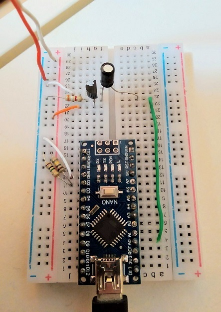

# Comelit Simplebus 1 compatible smart audio intercom
If you live in an older building with an audio-only door phone based on the SimpleBus version 1, you may have no choice for upgrading to a smart alternative. This project aims to build an open implementation of a smart doorphone compatible with the comelit simplebus 1 audio protocol, to replace ordinary units such as 2408w/a, 2708W and 2xx8W in general.

```diff
- If you are interested in the project, please get in touch! Your expertise is appreciated.
```



## State of the project
The SimpleBus class allows to receive and send commands on the bus.

A test sketch is included.

Tested on Arduino Nano.

TODO list:
- [ ] ~~Getting power from the bus~~ (it appears that there is not enough power)
- [x] Receiving messages from the bus
- [x] Sending messages on the bus
- [x] Listening to analog audio on the bus
- [ ] Transmitting analog audio on the bus
- [ ] Porting on Wemos D1, adding wifi communication
- [ ] Recording audio through the microcontroller ADC
- [ ] Transmitting audio through a DAC
- [ ] Web/cloud interface


## Acknowledgements
Thank you to Antonio Avallone for being the mantainer of the electronics side of this project

## Previous work
* http://stdio.be/blog/2014-08-17-Fixing-the-intercom-with-logic-analyzer/1
* https://hackaday.com/2019/10/27/reverse-engineering-a-two-wire-intercom/
