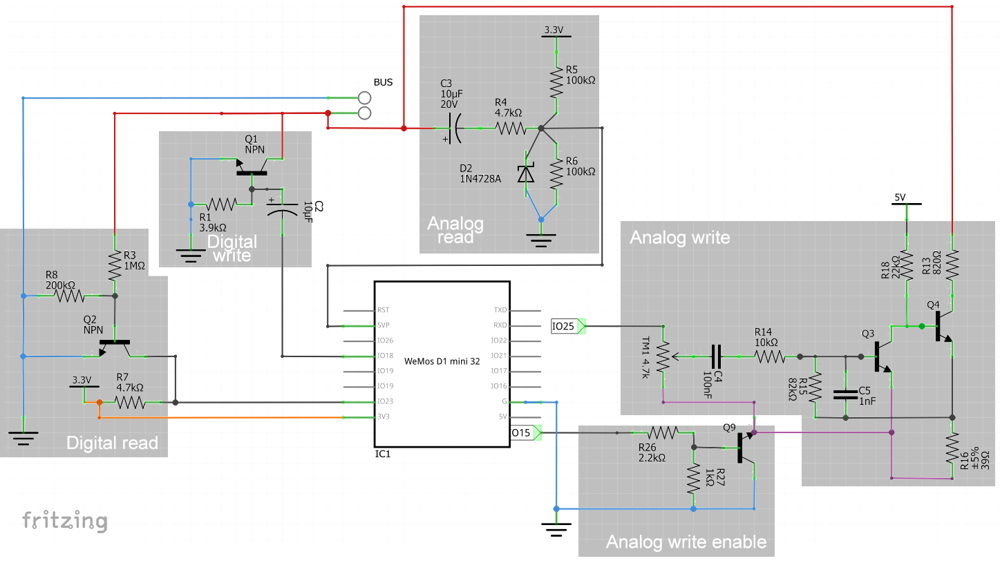

# Comelit Simplebus 1 compatible smart audio intercom
If you live in an older building with an audio-only door phone based on the SimpleBus version 1, you may have no choice for upgrading to a smart alternative. This project aims to build an open implementation of a smart doorphone compatible with the comelit simplebus 1 audio protocol, to replace ordinary units such as 2408w/a, 2708W and 2xx8W in general.

```diff
- If you are interested in the project, please get in touch! Your expertise is appreciated.
```

## Content of the repository
| Dir | Content 
------- | --- 
| libsimplebus | Arduino library that allows to interface with the digital bus 
| sketch_webmonitor | Arduino sketch that implements a websocket based https interface that logs what happens on the bus, including digital messages and analog audio. It also allows to make calls on the bus. 
| other | partial stuff, pending cleanup 

## Wiring

Wire according to the wiring diagram; **mind the polarity of the bus!**




## Protocol

The protocol features a ~24V bus. The units communicate through a digital protocol, by shorting the bus to produce short and long pulses.

Digital messages are composed of a 6 bit command, 8 bit "internal unit id" and 4 bit checksum. The start of a message is signaled by a longer pulse.
The recipient acknowledges every message by sending a sequence of three short pulses.

The audio is sent back and forth as an analog signal in base band on the bus itself once the communication has been established. Its peak-to-peak amplitude is about 2.5 volts.

Example of a communication
```
time: [41.404s] message: [000011 10110000 1010 - CALL 13 chkOK]
time: [41.457s] ack
time: [47.914s] message: [100010 10110000 1010 - PUP1 13 chkOK]
time: [47.961s] ack
time: [48.128s] message: [100011 10110000 0110 - PUP2 13 chkOK]
time: [48.172s] ack
time: [49.524s] message: [000010 10110000 0010 - OPEN 13 chkOK]
time: [49.571s] ack
time: [51.316s] message: [000010 10110000 0010 - OPEN 13 chkOK]
time: [51.362s] ack
time: [53.545s] message: [000010 10110000 0010 - OPEN 13 chkOK]
time: [53.592s] ack
time: [58.221s] message: [010010 10110000 1010 - HUP 13 chkOK]
time: [58.256s] ack
time: [68.616s] message: [111111 11111111 0111 - CLEAR 255 chkOK]
time: [68.952s] message: [111111 11111111 0111 - CLEAR 255 chkOK]
time: [69.289s] message: [111111 11111111 0111 - CLEAR 255 chkOK]
time: [69.626s] message: [111111 11111111 0111 - CLEAR 255 chkOK]
time: [69.963s] message: [111111 11111111 0111 - CLEAR 255 chkOK]
```


## State of the project
Tested on Wemos D1 mini32 (esp32 arduino core 1.0.5).

TODO list:
- [ ] ~~Getting power from the bus~~ (it appears that there is not enough power)
- [x] Receiving messages from the bus
- [x] Sending messages on the bus
- [x] Listening to analog audio on the bus
- [X] Transmitting analog audio on the bus
- [x] Porting on Wemos D1
- [x] Adding wifi communication
- [x] Implementing sleep
- [ ] Intercom protocol implementation (to be tested)
- [X] Recording audio through the microcontroller ADC
- [ ] Transmitting audio through a DAC
- [ ] Web/cloud interface


## Acknowledgements
Thank you to Antonio Avallone for his help with the electronics of this project

## Previous work
* http://stdio.be/blog/2014-08-17-Fixing-the-intercom-with-logic-analyzer/1
* https://hackaday.com/2019/10/27/reverse-engineering-a-two-wire-intercom/
