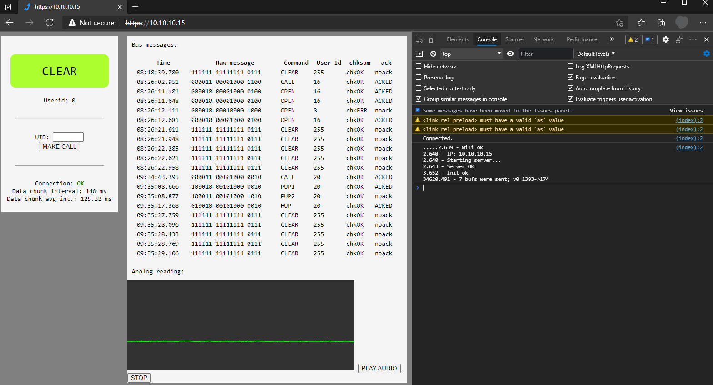
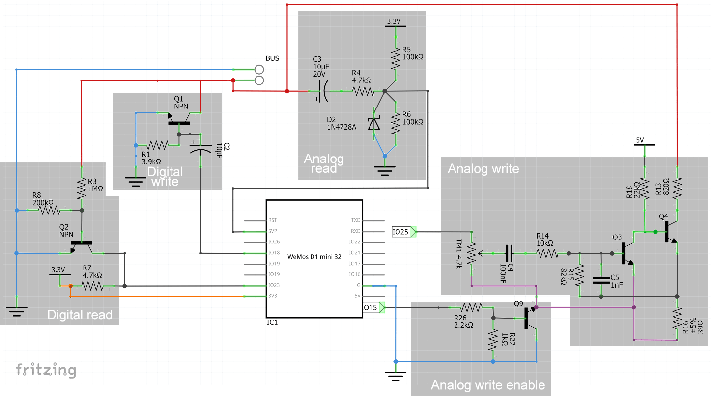

A web interface that:
- shows the bus status (clear / busy in a call, etc)
- logs the messages received on the bus
- allows to start a call to an internal unit
- shows the waveform read from the bus through ADC+DMA
- plays the waveform in real time through the browser

## Wiring

For reading the bus we use a voltage divider (R2,R3) connected to Q2; Q2 will open during the pulses on the bus, bringing the signal high on IO23 through the R7 pull-up resistor; IO23 is configured to handle rising-edge interrupts.

For writing to the bus we short the two ends of the bus through Q1, which is controlled by the pin IO18 through a capacitor.

For reading the analog voltages through the ADC (on pin GPIO35, SVP) we use the C3 capacitor to remove the 24V direct component, we then bias the signal again using the voltage divider (R5,R6).
The clipper circuit (D2, R4) is meant to limit the voltage spikes caused by the digital communication on the bus. The audio signal has an amplitude of 2.5 v peak to peak.

For writing analog voltages on the bus we use the two stage amplifier mede of Q3 and Q4. The signal is generated by the DAC on GPIO25 and fed through a potentiometer and an high-pass filter to the amplifier.
The amplifier is connected to ground through Q9, that can be used to turn the amplifier on and off through a GPIO pin (e.g. 16 in the figure, 15 in the sketch)